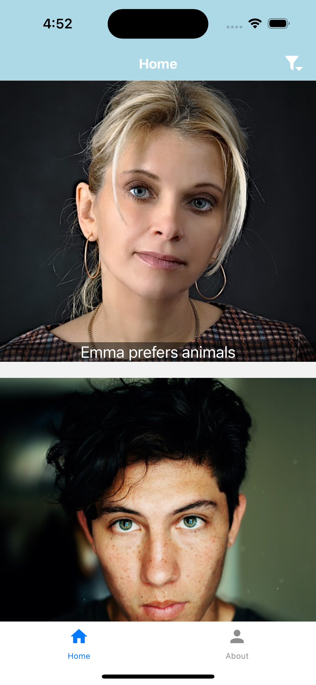
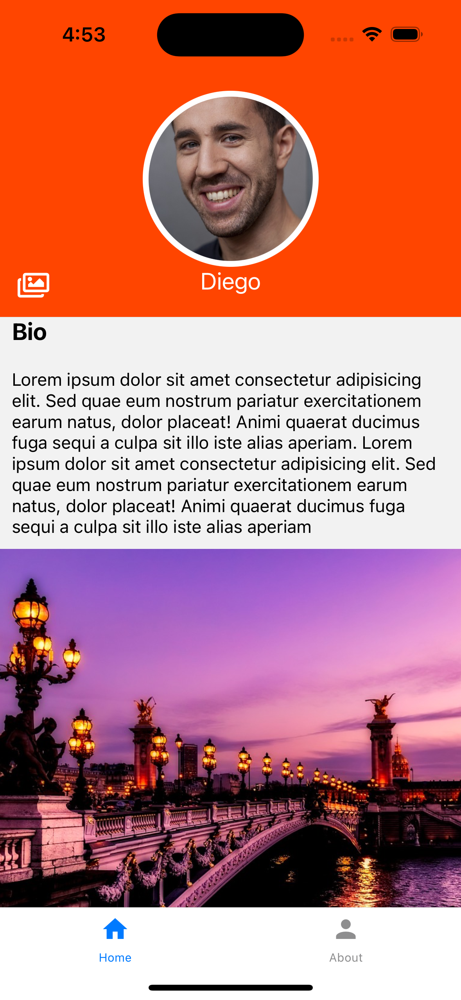
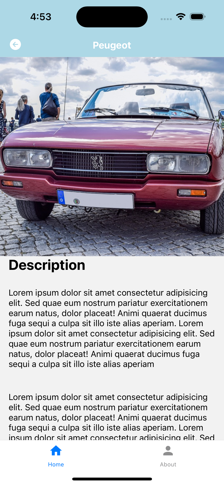
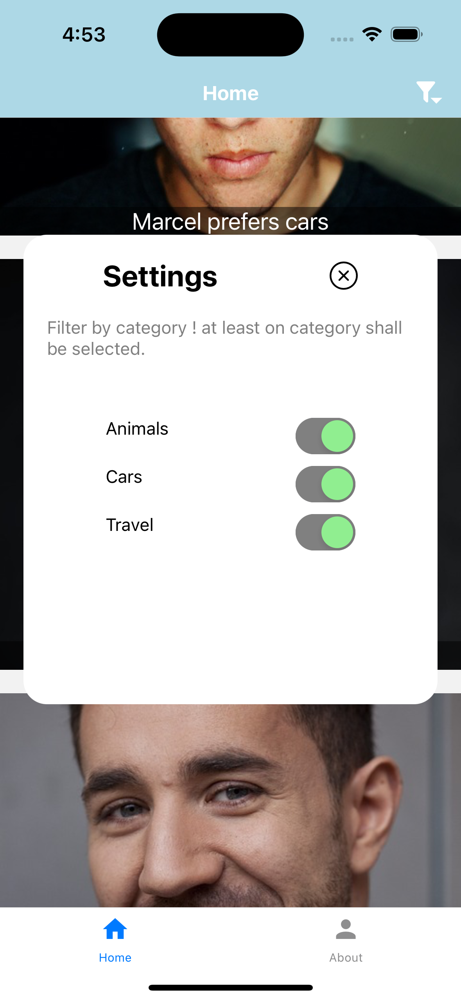

# Application de Partage de Photos

Bienvenue dans l'application de partage de photos ! Cette application vous permet de créer un compte, de partager des photos sur ce que vous aimez et d'explorer les photos partagées par d'autres utilisateurs.

## Fonctionnalités

L'application propose les fonctionnalités suivantes :

- **Créer un Compte** : Créez un compte utilisateur pour accéder à toutes les fonctionnalités de l'application.

- **Explorer** : Parcourez les photos partagées par d'autres utilisateurs. Utilisez des filtres pour trouver des photos sur des sujets spécifiques.

- **Profil** : Consultez votre profil utilisateur où vous pouvez voir les photos que vous avez partagées et gérer votre compte.

- **Partager des Photos** : Téléchargez et partagez vos propres photos sur ce que vous aimez. Ajoutez des légendes et des hashtags pour organiser vos photos.

## Captures d'écran

Voici un aperçu visuel des différents écrans de l'application :

## Captures d'écran

Voici un aperçu visuel des différents écrans de l'application :

| home | profile |
|:---------:|:------:|
|  |  |

| photos | filtre |
|:---------:|:----------:|
|  |  |

## Installation et Utilisation

Pour installer et utiliser l'application, suivez les étapes suivantes :

1. Clonez ce dépôt sur votre machine locale.
2. Installez les dépendances en exécutant `npm install`.
3. Lancez l'application en exécutant `npm start`.
4. Créez un compte utilisateur et commencez à partager des photos !

